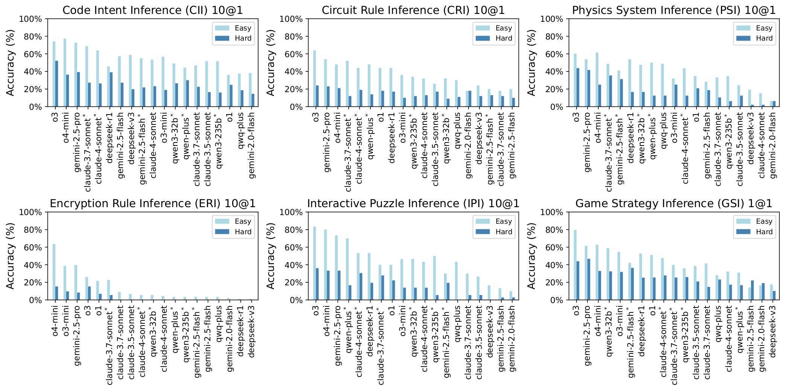
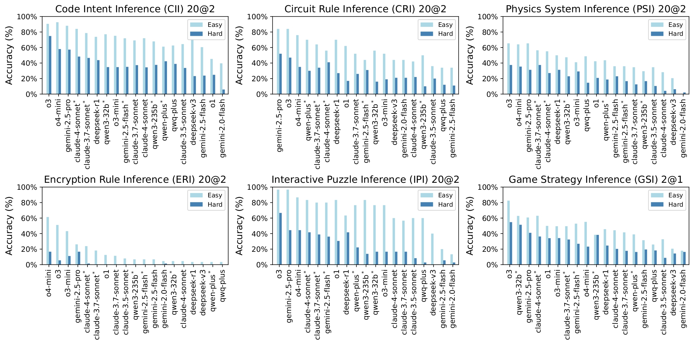

#  Oracle: Investigating Advanced Reasoning of Large Language Models via Black-Box Interaction

---

<p align="center">
    <a href="https://arxiv.org/abs/2508.19035" target="_blank" rel="noopener noreferrer">
        
    </a>
    <a href="https://oraclebenchmark.github.io" target="_blank" rel="noopener noreferrer">
        
    </a>
</p>

The Oracle benchmark investigates whether LLMs can independently explore unknown environment via black-box interaction. Current benchmark consists of 6 black-box tasks and 96 black-boxes, 50 of them are easy and 46 of them are hard. 19 popular LLMs are benchmarked.
Please check out the paper for more details, and this repo will detail how to run the evaluation.


## 💥 News

- **[2025.8.27]** 🎯 Paper available in arxiv.
- **[2025.8.23]** 🎯 We release the code for Oracle Benchmark v1.0.

## 📖 Quick Start

First install the necessary packages with (using a virtual environment is recommended, tested with python 3.11.3):
```
conda create --name oracle python=3.11.3
conda activate oracle
pip install -r requirements.txt
```
Then open ```.env``` file and replace "xxx" with your own LLM API key.

We provide three shell files to help quickly reproduce the performance of GPT-4.1 in the Oracle benchmark. 

* If you want to start a baseline test, try
    ```
    sh run_script_baseline.sh
    ```
    
* If you want to evaluate the performance of GPT-4.1 in a black-box named 'simple_substitution' from Encryption Rule Inference (ERI) task, try
    ```
    sh run_script_simple_substitution.sh
    ```

* If you want to start a concurrent 10@1 evaluation of all 19 benchmarked models for the Encryption Rule Inference (ERI) task, try
    ```
    sh run_script_concurrent.sh
    ```

The interaction history will be save under ```./history```, and the results will be saved under ```./results```.


## 📖 Easy Scaling

The Oracle benchmark features easy scaling. You can easily build a new black-box with the following steps:

1. If you want to build a black-box for existing tasks:
    * Add a json file that describes the mapping rules of a black-box to corresponding task folder (e.g., ```./task/encryption/easy```).
    * run ```python main.py --eva_model_family --eva_model_name gpt-4.1 --task 'task_name'```.

2. If you want to build a new black-box task:
    * Build a task folder under ```./task```, write the task introduction and system prompt for models in ```task_intro``` and ```player_system_prompt``` respectively.
    * (Optional) Add related functions for black-box implementation in ```./ckpt.py``` if needed.
    * Build a task folder under ```./platforms```, write request and system prompt for the automatic black-box generation framework.
    * Build a task folder under ```./test```, write prompt for test sample generator, and complete related code in ```TestSamplesGenerator``` class in ```./auto_generation.py```.
    * run ```python main.py --eva_model_family --eva_model_name gpt-4.1 --task 'task_name'```.

The generated interaction history during iterative debugging will be saved in ```./logs```.

## 🏆 Leaderboard




## ✨ Contribution
Congchi Yin, Tianyi Wu, Yankai Shu contribute to the code implementation. We welcome contributions of black-boxes and black-box tasks from the community.

## 📚 Citation

If you find our work useful, please cite us:
```
@misc{yin2025investigatingadvancedreasoninglarge,
      title={Investigating Advanced Reasoning of Large Language Models via Black-Box Interaction}, 
      author={Congchi Yin and Tianyi Wu and Yankai Shu and Alex Gu and Yunhan Wang and Jun Shao and Xun Jiang and Piji Li},
      year={2025},
      eprint={2508.19035},
      archivePrefix={arXiv},
      primaryClass={cs.AI},
      url={https://arxiv.org/abs/2508.19035}, 
}
```